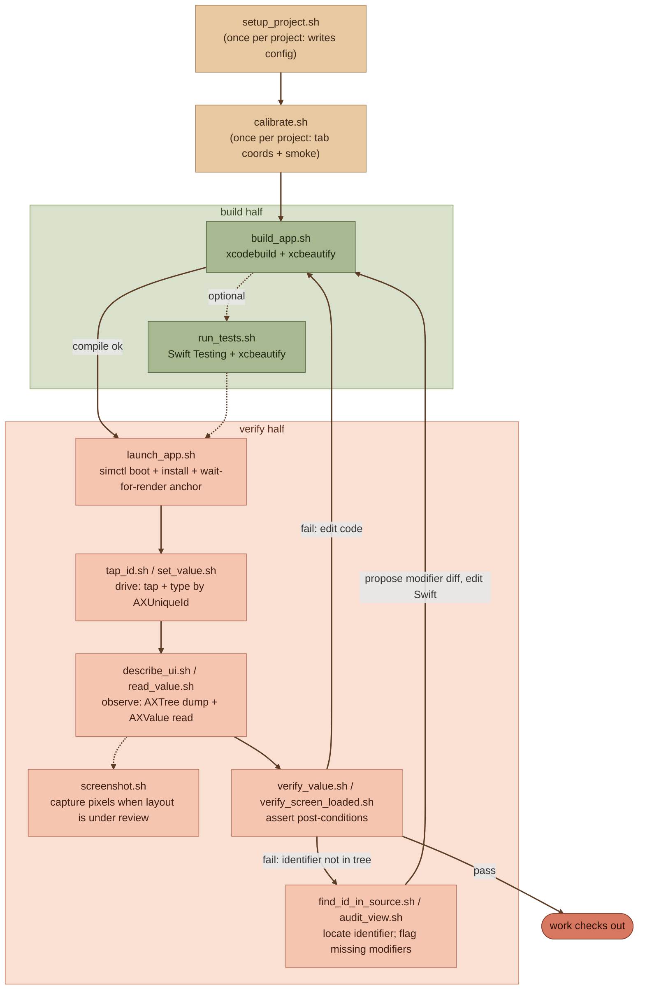

ios-build-verify
================

[](https://github.com/vermont42/ios-build-verify/blob/main/LICENSE)
[](https://github.com/vermont42/ios-build-verify/stargazers)

A Claude Code skill that closes the agentic loop for SwiftUI iOS apps. It bundles `xcodebuild` with [xcbeautify](https://github.com/cpisciotta/xcbeautify) for token-cheap building and unit-testing, and it pairs [AXe](https://github.com/cameroncooke/AXe) with `xcrun simctl` for accessibility-tree-driven visual verification and UI interaction in the iOS Simulator. Built and validated against **Claude Code with Claude Opus 4.7**.


*Axolotls regenerate what they damage. ios-build-verify gives your agent the same trick: build, verify, fix, repeat, until the work checks out on its own.*

# What This Skill Does

Anthropic's [*Best Practices for Claude Code*](https://code.claude.com/docs/en/best-practices) provides this advice: *"Include tests, screenshots, or expected outputs so Claude can check itself. This is the single highest-leverage thing you can do."* Without a verification loop, the human becomes the sole feedback channel, and every mistake the agent makes commands the human's attention.

`ios-build-verify` is an applied instance of that principle for SwiftUI iOS apps. It bundles two halves of the agentic loop behind named, semantically meaningful operations.

- **Build operations.** `xcodebuild` piped through `xcbeautify` for compile and for test runs, with raw output mirrored to `build.log` as a diagnostic fallback. A successful build that would emit roughly 5,000 lines of compile, link, and codesign noise reduces to a handful of structured lines; failures surface with `file:line:col:` anchors. Test runs render as one line per case plus a tally, savings that compound as the suite grows.
- **Verify operations.** AXe (Cameron Cooke's Swift-native simulator-automation CLI) plus `xcrun simctl` driven through named-intent scripts: launch the app, tap by accessibility identifier or by accessibility label, read or set a field's value, verify a screen has loaded, screenshot a named view, audit a view for missing accessibility modifiers. State checks read `axe describe-ui`'s structured accessibility-tree dump (a few hundred tokens per call) rather than screenshots (1,600 to 6,300 image tokens), favoring text before pixels. Screenshots are written to disk and read only when layout, typography, color, or spacing are actually under review.

Every token saved on build noise or on screenshot pixels is a token that stays in the context budget for the work the human cares about. The agent invokes operations by intent; the underlying `xcodebuild`, `axe`, and `simctl` commands are composed by the skill's scripts. `SKILL.md` documents each script and its exit codes.

This is *self-verification*, not self-direction or self-deployment. The agent verifies that its output meets criteria the human set; the human still defines the spec and reviews the result. Self-verification is the precondition for higher-quality human review, not its abolition.

# The Loop

The loop the skill closes, in one picture:



# Origin Story

I built `ios-build-verify` because of verification frustration I experienced developing [Konjugieren](https://apps.apple.com/us/app/konjugieren/id6758258747) ([source](https://github.com/vermont42/Konjugieren/)). The agent could write code; the agent could run `xcodebuild`. But anything past compilation (does this screen render? does that picker actually update? did the bug repro?) required me to launch a simulator, exercise the UI, screenshot, and feed the result back. I was the entire feedback loop in the implementation middle. The skill is what I wish I had then.

Conor Luddy's [ios-simulator-skill](https://github.com/conorluddy/ios-simulator-skill) was the inspiration to build my own: same problem, different toolchain (Python, with xcresult parsing). His post [*Bringing Accessibility into the AI Coding Workflow*](https://www.conor.fyi/writing/ai-access) introduced me to using the SwiftUI accessibility tree as the cheap, structured observation primitive for agent verification on iOS, an idea on which `ios-build-verify`'s text-before-pixels strategy rests.

I have tested `ios-build-verify` against Konjugieren, incorporated fixes based on that testing, and plan to use the skill going forward on Konjugieren and on other iOS projects.

# Dependencies

- **[Xcode](https://developer.apple.com/xcode/)**: provides `xcodebuild` and `xcrun simctl`.
- **[Homebrew](https://brew.sh/)**: package manager for the rest of the stack.
- **[xcbeautify](https://github.com/cpisciotta/xcbeautify)**: `brew install xcbeautify`. Swift-native log formatter that reduces a successful build from thousands of lines to a handful and surfaces failures with `file:line:col:` anchors.
- **[AXe](https://github.com/cameroncooke/AXe)**: `brew install cameroncooke/axe/axe`. Swift-native simulator-automation CLI; powers the verify half.
- **[jq](https://jqlang.github.io/jq/)**: `brew install jq`. Filters `axe describe-ui` output in several scripts.
- **Optional: [Pillow](https://pillow.readthedocs.io/)**: `python3 -m pip install --user --break-system-packages Pillow` or `brew install pillow`. Required only by `measure_tab_pill.sh` for centroid detection on screenshots during tab-coordinate calibration. Missing Pillow blocks tab-pill calibration but no other verify operation.

The dependency graph is deliberately narrow: tooling already on most iOS developers' Macs (Xcode plus Homebrew), one Swift binary (AXe), one shell utility (jq), and Pillow only for the optional calibration path. No Python runtime for the main loop. No Node. No long-running daemon. No MCP server. No `idb_companion` daemon to run.

# Skill Compatibility

`ios-build-verify` wraps the AXe binary directly. **Do not also install Cameron Cooke's standalone AXe Claude Code skill alongside this one.** The two skills' `description` frontmatter overlap nearly word-for-word ("tap, screenshot, describe UI on the iOS Simulator"), and an agent scanning the available-skills list will gravitate toward the lower-level skill rather than toward the named-intent operations this one is built around. A May 2026 validation session was tripped up by exactly this overlap until the standalone skill was uninstalled. AXe the *binary* is required; AXe the *standalone skill* should be uninstalled if present.

# Greenfield Versus Brownfield Use

The verify half reads SwiftUI's accessibility tree, so its quality depends on whether the target app carries `.accessibilityIdentifier` and `.accessibilityValue` modifiers on the elements being tapped, queried, or asserted against. The skill is **lenient, not strict**: it works against whatever annotations are present, and verification quality scales with annotation coverage rather than failing without it. Three adoption paths follow.

- **Greenfield projects.** Adopt the recommended convention ab initio. Every new verifiable element gets `.accessibilityIdentifier` (and `.accessibilityValue` if stateful), named per `{category}_{context}_{element}` (for example, `card_settings_correlation`, `input_convert_month`). The agent applies the policy on every new view; the codebase grows annotation-complete by default, and the skill's verify operations work without migration friction.
- **Existing projects, migration-by-use (recommended default).** Verify operations include an annotation-check phase: when the agent verifies a screen, it ensures the relevant elements carry the necessary modifiers and proposes additions inline as part of the same change. Migration cost amortizes across normal feature work; coverage grows wherever you work; every annotation added is justified at the moment of writing by the verification flow that needed it. No daunting whole-project audit task.
- **Existing projects, bulk audit (optional power-user).** `scripts/audit_view.sh` audits a single view's accessibility coverage and reports missing modifiers. Run it across the views you most often verify, then refine the raw report into proposed diffs.

# How to Use This Skill

This skill is built for **Claude Code with Claude Opus 4.7** and has not been validated against other harnesses or against other models. See "Validated Configuration" below.

## Personal Usage

To install for your personal use in Claude Code:

1. Add the marketplace:
   ```
   /plugin marketplace add https://github.com/vermont42/ios-build-verify
   ```
2. Install the skill:
   ```
   /plugin install ios-build-verify
   ```

## Project-Wide Usage

To install for everyone on a project, add the following to your `.claude/settings.json`:

```json
{
  "plugins": {
    "ios-build-verify": {
      "source": "https://github.com/vermont42/ios-build-verify"
    }
  }
}
```

## Manual Installation

1. Clone this repository.
2. Copy or symlink the `skills/ios-build-verify/` folder into `~/.claude/skills/` (personal) or into `<project>/.claude/skills/` (project-scoped).

## Suggested First-Use Prompt

After installing, in the Claude Code session that should set the skill up in your project, type:

> Please set up ios-build-verify in this project.

The trailing "in this project" pins `cwd` as the target rather than letting the agent ask where to install. Do *not* pre-mention specific concerns (existing CLAUDE.md build commands, non-canonical bundle identifiers, custom schemes); `SKILL.md`'s first-use [colloquy](https://en.wiktionary.org/wiki/colloquy) is structured to surface those itself, and pre-mentioning them short-circuits the colloquy.

The colloquy collects the app's display name, the bundle identifier, the Xcode project file, the scheme, the target simulator, an accessibility identifier known to be present on the launch screen, and the app's main TabView tab names in render order. Answers land in `<project>/.claude/ios-build-verify.config.sh`. The colloquy also offers to add appropriate entries to the project's `.gitignore`.

# Validated Configuration

`ios-build-verify` has been validated against Claude Code (CLI) running Claude Opus 4.7. The shell scripts themselves are harness-agnostic, but the skill's *use* leans on agent judgment in places that have only been exercised on this configuration: reading `SKILL.md` after a script exits with a documented error code and applying the corresponding workaround, recognizing when to edit per-project versus skill-shared data files, and running the first-use colloquy without it derailing.

Behavior on untested configurations (Sonnet, Haiku, non-Anthropic models, IDE-embedded agents, MCP-driven setups, Cursor / Cline / Aider / and so on) may vary from "works fine" to "subtly wrong in ways that look like skill bugs but are actually agent-judgment shortfalls". This is scope of validation, not scope of permission.

# Acknowledgments

- **Antoine van der Lee** inspired, via [SwiftUI Agent Skill](https://github.com/AvdLee/SwiftUI-Agent-Skill), this skill's installation instructions.
- **Anthropic** named, in [*Best Practices for Claude Code*](https://code.claude.com/docs/en/best-practices), self-verification as the single highest-leverage discipline an agent can possess. This skill is an applied instance of that principle for SwiftUI iOS apps.
- **Cameron Cooke** created [AXe](https://github.com/cameroncooke/AXe), the Swift-native simulator-automation CLI that powers the verify half of this skill.
- **Charles Pisciotta** created [xcbeautify](https://github.com/cpisciotta/xcbeautify), the Swift-native xcodebuild log formatter that makes the build half of this skill token-efficient.
- **Conor Luddy** inspired me, via [ios-simulator-skill](https://github.com/conorluddy/ios-simulator-skill), to build my own verification skill. His post [*Bringing Accessibility into the AI Coding Workflow*](https://www.conor.fyi/writing/ai-access) introduced me to using the SwiftUI accessibility tree as the cheap, structured observation primitive for token-efficient agent verification on iOS.
- **Lawrence Lomax** drove initial development of [idb](https://github.com/facebook/idb), the simulator-automation framework that AXe builds on.

# License

This skill is provided under the open-source MIT License. See [LICENSE](LICENSE) for details.
